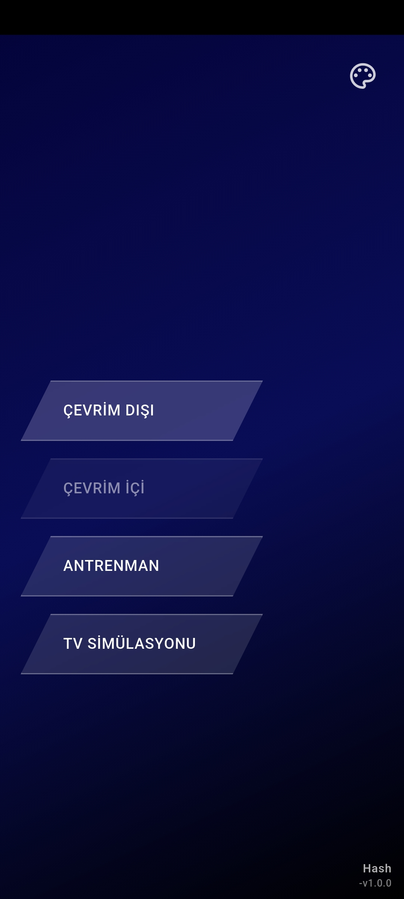
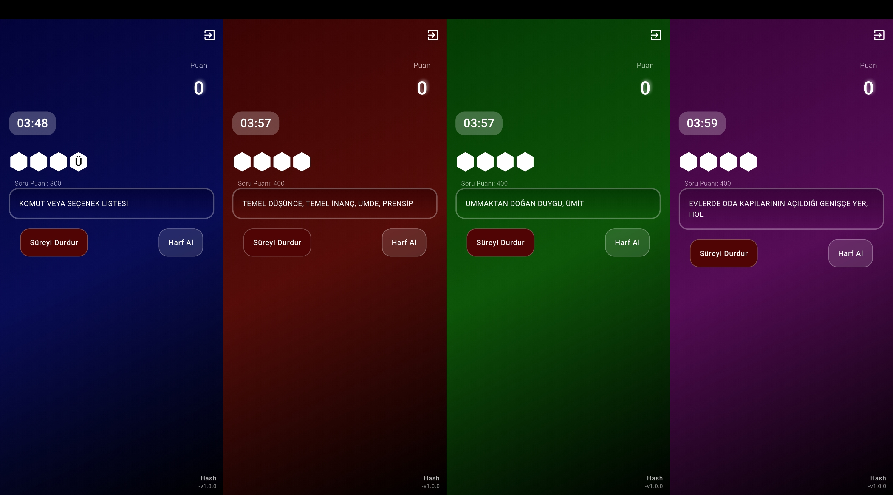
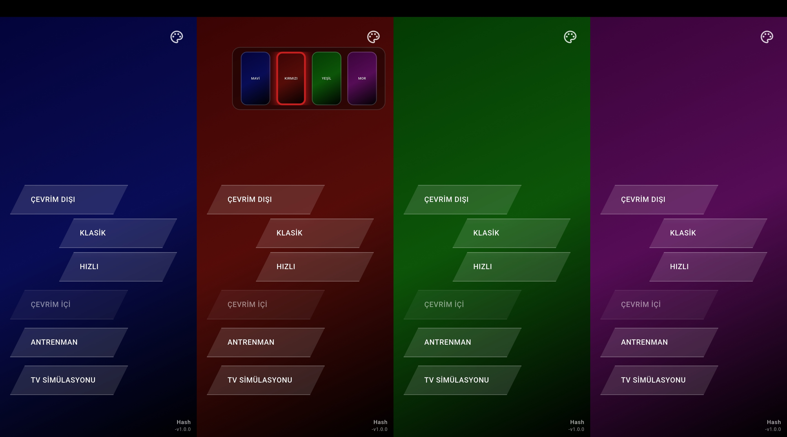
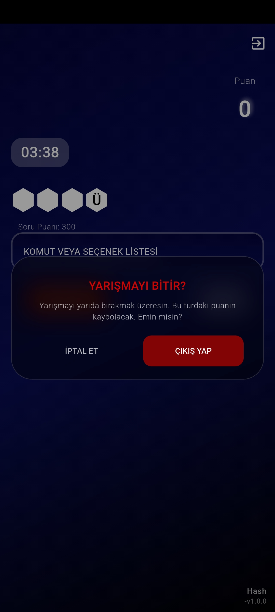

# Kelime

**“Kelime.”** is a fast-paced, offline-first word puzzle application built with Flutter. Designed for language enthusiasts, it challenges users to find words based on dictionary definitions using a vast local database, ensuring a seamless, zero-latency gaming experience without the need for an internet connection.

> *Note: This repository serves as a UI/UX and product showcase. The source code is kept private.*

---

## Key Features & User Interface

### Versatile Game Modes
The main menu features four distinct modes: **Offline**, **Online**, **Practice**, and **Studio Mode**. Tapping the Offline mode elegantly expands the UI to reveal two additional sub-options, giving users full control over their experience.

  
  &nbsp;&nbsp;&nbsp;&nbsp;

### Dynamic Gameplay Experience
A thrilling puzzle-solving environment where users reveal letters and guess words before the time runs out. The UI utilizes custom hexagonal shapes to present letters in a visually engaging way.

  

### Custom Themes
Personalize the look and feel. Users can instantly switch between 4 unique color and design themes directly from the main screen to match their mood.

  

### Polished Interactions
Every detail is crafted for immersion, from fluid dialog boxes to the elegantly blurred exit screens that maintain the app's premium feel.

  

---

## Technical Architecture

Beneath the sleek UI lies a robust and modern mobile architecture:

*   **Framework:** Flutter / Dart
*   **Database Management:** Powered by `sqflite`, utilizing a comprehensive local SQLite database to fetch thousands of words and definitions instantly (0ms latency).
*   **UI Components:**
    *   **`blur`:** Implemented for sophisticated frosted glass and depth-of-field effects across dialogs.
    *   **`hexagon`:** Used to render the custom, geometric letter tiles during gameplay.
*   **Architecture:** Offline-First Design, ensuring 100% functionality regardless of network conditions.